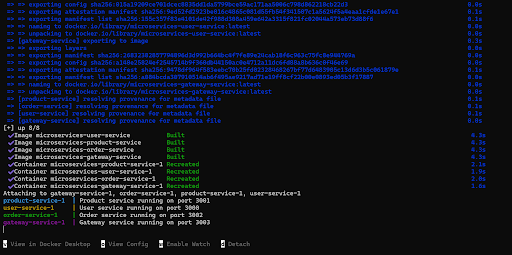
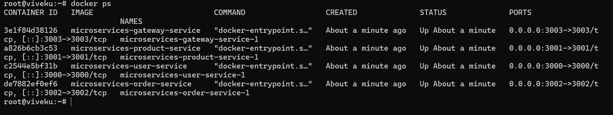
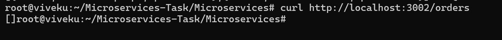
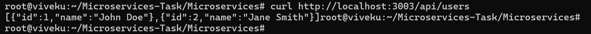
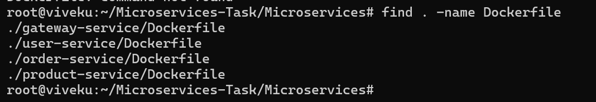
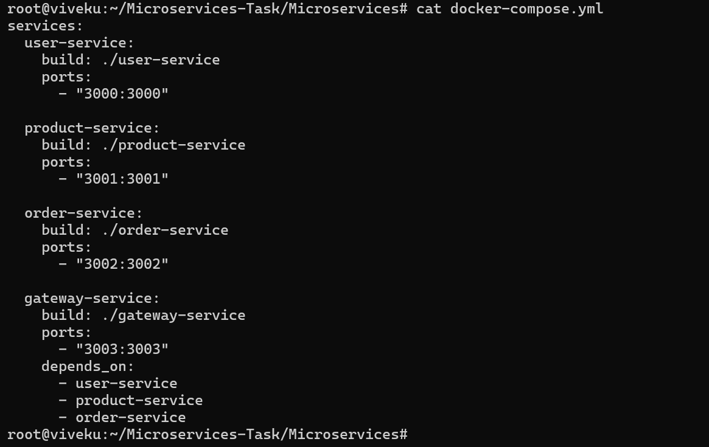

# Microservices Task

## Overview

This project demonstrates a microservices architecture using Node.js, Express, Docker, and Docker Compose.

## Services Included

- User Service
- Product Service
- Order Service
- Gateway Service

## Project Structure

```text
Microservices/
├── user-service
├── product-service
├── order-service
├── gateway-service
├── docker-compose.yml
└── README.md

## Screenshots

### Docker Compose Running



### Docker Containers



### User Service Response


### Product Service Response


### Order Service Response



### Gateway Users Response



### Gateway Products Response


### Gateway Orders Response


### Dockerfile



### docker-compose.yml



## Technologies Used

- Node.js
- Express.js
- Axios
- Docker
- Docker Compose
